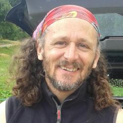

    
####################
CV Patrick Deflandre
####################

-------------------------------------------------------
Conception et développement de systèmes embarqués Linux
-------------------------------------------------------

Grenoble, France, +33 (0)6 77 29 85 61, patrick.deflandre@gmail.com

******
Résumé
******

    Je suis à la recherche d'opportunités qui me permettent de valoriser et d'améliorer mes compétences GNU/Linux sur des projets si possible Open Source. Une ambiance startup ne serait pas pour me déplaire. Je souhaite travailler en équipe.
    
    Passionné par la découverte et l'apprentissage de nouvelles technologies, j'ai toujours cherché à améliorer mes produits en incluant les avancées à ma disposition. Je me suis ainsi spécialisé de plus en plus dans le développement logiciel.

    J'ai conçu du hardware et développé des logiciels pendant une quinzaine d'années pour des systèmes électroniques embarqués basés sur des micro-contrôleurs. J'ai utilisé pour cela des outils issus de la communauté Open Source : gcc, eclipse, openOCD, LwIP, FreeRTOS... Je développe depuis tous mes projets dans un environnement GNU/Linux Debian. A mes débuts, j'ai aussi utilisé des environnement propriétaires : Keil, IAR

    Je souhaite que mes nouveaux projets soit communiquant et je m'intéresse au monde des objets connectés.

    J'ai choisi de me former au langage Python pour la programmation objet, Raspberry pour le support matériel, et Yocto pour la mise en place à terme d'une distribution spécifique sur une nouvelle plate-forme matériel.

    J'utilise Git pour la gestion de mes développement et pour me permettre de travailler en équipe/communauté. J'ai utilisé CVS précédemment.

    L'apprentissage ne sera jamais terminé, mais je commence à vraiment bien connaître l'environnement GNU/Linux Debian et Raspbian.

**********
Expérience
**********

Concepteur/développeur électronique embarquée
=============================================
* GEA - GRENOBLOISE D'ÉLECTRONIQUE ET D'AUTOMATISMES
* 1999 – Aujourd’hui (18 ans) Meylan - France

    J'ai acquis progressivement une expertise dans la programmation temps réel de cibles à micro-contrôleurs. Mes principaux développement ont porté sur le contrôle de mécanismes d'impression thermique, et sur des systèmes d'affichage d'informations. A cela s'ajoute d'autres développement sur le contrôle d'accès par titre magnétique et RFID, ainsi que de la gestion de système d'entrée sortie.

    Certains de mes développements ont mis en oeuvre un noyau temps réel FreeRTOS et une pile IP LwIP. D'autres ont été programmés sous forme événementielle et procédurale. J'ai principalement effectués ces développements sur des stations Linux Debian et avec des outils open source.

    Je travaille maintenant sur l'intégration de Linux dans nos systèmes embarqués. Je concentre mes efforts autour des cartes Raspberry Pi et de la distribution Raspbian, et développe de nouveaux applicatifs en Python. A terme, je pense m'orienter vers d'autre plates-formes matériels et sans doute vers une distribution spécifique à mettre en place à l'aide de Yocto.

    
Quelques projets
----------------

Linux embarqué - Raspberry Pi - enregistreur de traces autonome
^^^^^^^^^^^^^^^^^^^^^^^^^^^^^^^^^^^^^^^^^^^^^^^^^^^^^^^^^^^^^^^
* depuis mars 2013

    Mise en place d'un framework d'entreprise.
    
    Utilisation de la distribution GNU/Linux Raspbian.
    Programmation en Python.
    Mise en place de services sftp, ssh, point d'accès wi-fi.

    Construction de paquets pour installation par le gestionnaire apt.
    Création des scripts d'installations en bash.

    Mise en place d'un dépôt de distribution des paquets métiers (reprerepro, lighttpd).

Linux embarqué - Atmel SAMA5D3X - Pré-étude d'une carte électronique utilisant un noyau Linux
^^^^^^^^^^^^^^^^^^^^^^^^^^^^^^^^^^^^^^^^^^^^^^^^^^^^^^^^^^^^^^^^^^^^^^^^^^^^^^^^^^^^^^^^^^^^^
* Date de début : septembre 2013

    Utilisation d'un kit d'évaluation et développement Atmel SAMA5D3X.
    
    * Utilisation de buildroot, puis de Yocto Project.
    * Apprentissage des fonctionnalités offertes par les projets OpenEmbedded et Yocto.
    * Générations d'images systèmes, noyau, u-boot...
    * Création d'une distribution Linux embarquée personnalisée.
    * Utilisation...

Linux embarqué - utilisation de Yocto
^^^^^^^^^^^^^^^^^^^^^^^^^^^^^^^^^^^^^
* février 2015

    Apprentissage des techniques de créations d'images systèmes pour cible embarqué.

    
Atmel at91sam7x - FreeRTOS - Imprimante IP sur papier thermique
^^^^^^^^^^^^^^^^^^^^^^^^^^^^^^^^^^^^^^^^^^^^^^^^^^^^^^^^^^^^^^^
* juin 2009 – août 2012

    * Développement d'une carte de contrôle d'un module d'impression APS HSP3500.
    * Vitesse d'impression : 250 mm/s
    * Communication : par IP
    * Services : http, telnet, serveur d'impression, tftp, système de fichiers.
    * OS : FreeRTOS
    
    Ce qui m'a marqué dans ce projet : la simplification apporté par l'os pour la programmation événementielle. La difficulté de mise en place de tous les différents services IP et du système de fichiers.
    
    Conclusion : mes prochains projet seront sous Linux, quitte à développer des cartes d'extensions hardware et leurs drivers associés.

Atmel at91sam7x - FreeRTOS - Imprimante com série sur papier thermique
^^^^^^^^^^^^^^^^^^^^^^^^^^^^^^^^^^^^^^^^^^^^^^^^^^^^^^^^^^^^^^^^^^^^^^
* février 2011 – décembre 2012

    * Développement d'une carte de contrôle de 2 modules d'impression Axiohm RMDV ou RMDG.
    * Communication par liaison série.
    * Vitesse d'impression 100 mm/s.
    * OS : FreeRTOS

Afficheur client haute lisibilité 3 lignes
^^^^^^^^^^^^^^^^^^^^^^^^^^^^^^^^^^^^^^^^^^
* 2001 - 2011
* msp430f149

    Développement hardware et logiciel.
    
    J'ai mis en place une structure modulaire, pour permettre des adaptations rapides pour nos différents clients.
    Cette afficheur à été et est toujours vendu sous de nombreuses déclinaisons.
    

Afficheur client graphique
^^^^^^^^^^^^^^^^^^^^^^^^^^
* 2001 - 2011
* Infineon C163
* Scenix SX28L

    Développement hardware et logiciel.
    
    * une carte pour le rafraîchissement de l'afficheur
    * une autre carte pour la gestion de la communication et des messages
        

Contrôle d'accès piéton dans les parkings
^^^^^^^^^^^^^^^^^^^^^^^^^^^^^^^^^^^^^^^^^
* 2001 - 2009
* Infineon C163

    Développement hardware et logiciel.
    
    Mise en place d'un réseau propriétaire de communication inter-cartes par pooling maître / esclave.
    
    Lecture de badge RFID

Simulateur de DAC
^^^^^^^^^^^^^^^^^
* Octobre 2004
* Infineon C163
    
    Développement logiciel d'un outil de test interne pour simplifier la validation de nos logiciels de gestion de péage.

Automate Entrées/Sorties
^^^^^^^^^^^^^^^^^^^^^^^^
* 2001-2007
* Infineon C163

    Plusieurs développement hardware et logiciel d'automates.
    
    Utilisé par exemple pour commander des barrières, faire des détection de type de véhicule, ou encore servir de commande IHM

    
*******
Langues
*******

    Anglais, lu assez bon, écrit et parlé moyen

    
***********
Compétences
***********

    C, Systèmes embarqués, Linux, Électronique, Gestion de projet, Eclipse, Microcontrollers, Embedded Systems, RTOS,  FreeRTOS, Raspberry Pi, Python, Debian, Debian packages, Raspbian, Git, Gcc/g++, ARM, Open Source, Testing, HTML, Ethernet, TCP/IP

    
*********
Formation
*********

IUT Joseph Fourier / Grenoble
=============================
DUT, Génie électrique et informatique industrielle
--------------------------------------------------
* 1991 – 1992

Lycée Mariette / Boulogne sur mer
=================================
Math Spé, M
-----------
* 1988 – 1990

    Activités et associations : Planche à voile, dériveur. Brevet de Pilote Privé Avion.

Opéra National de Paris
=======================
Elève de l'école de Danse pendant 5 ans
---------------------------------------
* 1982 – 1986

    Participation à de nombreux spectacles à l'Opéra, mais aussi en tournée en France, en Allemagne et au Japon.
    
    Quelques un de mes camarades d'école sont devenu danseurs Étoiles de l'Opéra.
    
    J'ai acquis durant ces années un sens du détail, une capacité de travail et une sensibilité artistique.

    
*********************
Infos supplémentaires
*********************

Centres d'intérêt
=================

    * J'aime jouer de la guitare, faire du vélo, les activités de plein air et randonner.
    * J'adhère aux principes du logiciel libre.
